# Scikit-learn Developer Guide

This guide provides comprehensive instructions for developing and contributing to the scikit-learn machine learning library, including detailed architecture insights and component interactions.

## Table of Contents
1. [Project Overview](#project-overview)
2. [Architecture & Design Patterns](#architecture--design-patterns)
3. [Development Environment Setup](#development-environment-setup)
4. [Build System Architecture](#build-system-architecture)
5. [Project Structure](#project-structure)
6. [Development Workflow](#development-workflow)
7. [Code Style and Standards](#code-style-and-standards)
8. [Testing](#testing)
9. [Documentation](#documentation)
10. [Sample Feature Implementation](#sample-feature-implementation)
11. [Common Development Tasks](#common-development-tasks)
12. [Troubleshooting](#troubleshooting)

## Project Overview

Scikit-learn is a Python machine learning library built on NumPy, SciPy, and joblib. It provides:
- Simple and efficient tools for predictive data analysis
- Accessible to everybody, and reusable in various contexts
- Built on scientific Python stack (NumPy, SciPy, matplotlib)
- Open source, commercially usable (BSD license)

### Key Technologies
- **Python 3.10+**: Minimum supported version
- **Build System**: Meson (with meson-python)
- **Compiled Extensions**: Cython for performance-critical code
- **Testing**: pytest
- **Linting**: ruff
- **Type Checking**: mypy
- **Documentation**: Sphinx with sphinx-gallery for examples
- **Parallel Computing**: joblib with multiple backends
- **Linear Algebra**: NumPy/SciPy with BLAS/LAPACK integration

## Architecture & Design Patterns

### Core Design Philosophy

Scikit-learn follows a consistent API design that emphasizes:
- **Consistency**: All estimators follow the same interface
- **Inspection**: Fitted estimators store learned attributes with trailing underscore
- **Non-proliferation**: Limited number of object types (estimators, transformers, predictors)
- **Composition**: Complex behavior through combination of simple objects
- **Sensible defaults**: Parameters have reasonable default values

### Estimator Hierarchy

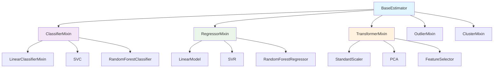
```mermaid
graph TD
    A[BaseEstimator] --> B[ClassifierMixin]
    A --> C[RegressorMixin]
    A --> D[TransformerMixin]
    A --> E[OutlierMixin]
    A --> F[ClusterMixin]
    
    B --> G[LinearClassifierMixin]
    B --> H[SVC]
    B --> I[RandomForestClassifier]
    
    C --> J[LinearModel]
    C --> K[SVR]
    C --> L[RandomForestRegressor]
    
    D --> M[StandardScaler]
    D --> N[PCA]
    D --> O[FeatureSelector]
    
    style A fill:#e1f5fe
    style B fill:#f3e5f5
    style C fill:#e8f5e8
    style D fill:#fff3e0
```

### API Pattern Flow

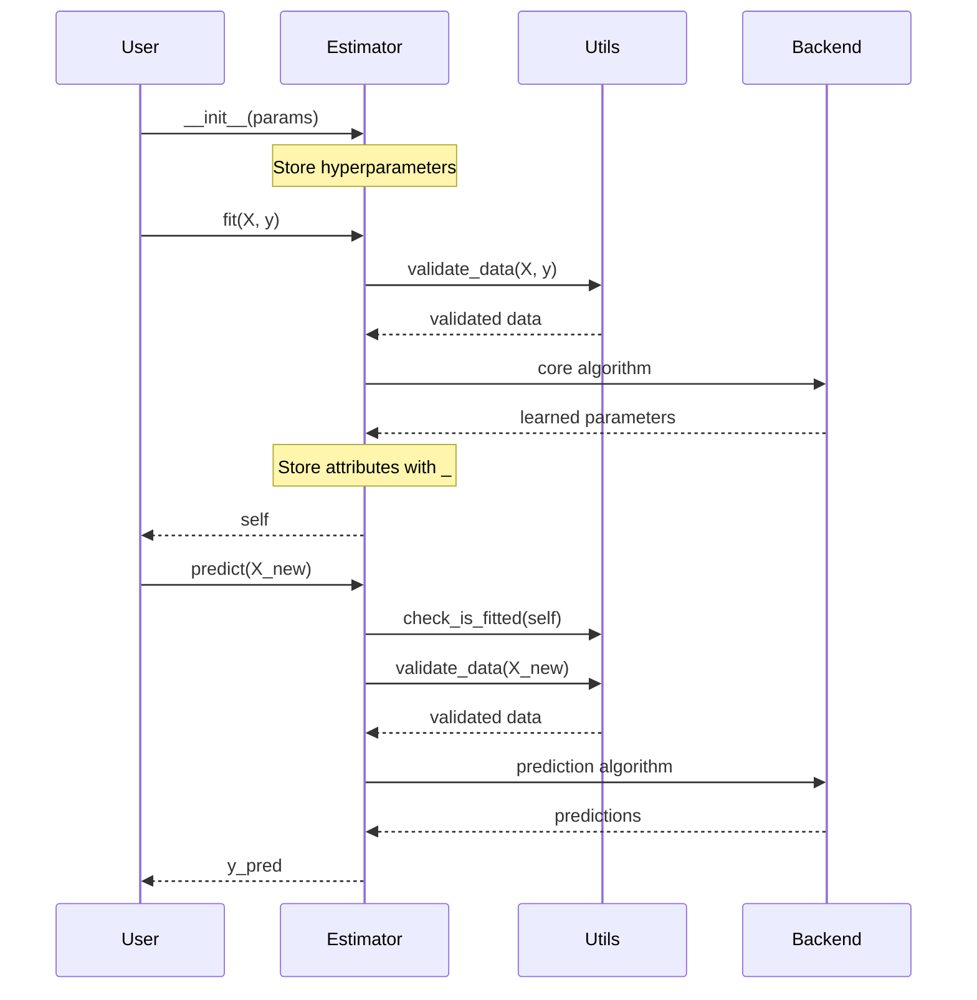
```mermaid
sequenceDiagram
    participant User
    participant Estimator
    participant Utils
    participant Backend
    
    User->>Estimator: __init__(params)
    Note over Estimator: Store hyperparameters
    
    User->>Estimator: fit(X, y)
    Estimator->>Utils: validate_data(X, y)
    Utils-->>Estimator: validated data
    Estimator->>Backend: core algorithm
    Backend-->>Estimator: learned parameters
    Note over Estimator: Store attributes with _
    Estimator-->>User: self
    
    User->>Estimator: predict(X_new)
    Estimator->>Utils: check_is_fitted(self)
    Estimator->>Utils: validate_data(X_new)
    Utils-->>Estimator: validated data
    Estimator->>Backend: prediction algorithm
    Backend-->>Estimator: predictions
    Estimator-->>User: y_pred
```

### Module Dependency Architecture

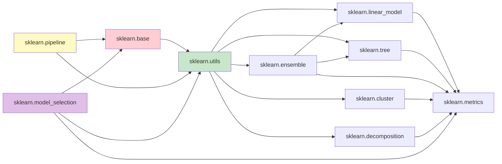
```mermaid
graph LR
    A[sklearn.base] --> B[sklearn.utils]
    B --> C[sklearn.linear_model]
    B --> D[sklearn.tree]
    B --> E[sklearn.ensemble]
    B --> F[sklearn.cluster]
    B --> G[sklearn.decomposition]
    
    C --> H[sklearn.metrics]
    D --> H
    E --> H
    F --> H
    G --> H
    
    E --> C
    E --> D
    
    I[sklearn.pipeline] --> A
    I --> B
    
    J[sklearn.model_selection] --> A
    J --> B
    J --> H
    
    style A fill:#ffcdd2
    style B fill:#c8e6c9
    style I fill:#fff9c4
    style J fill:#e1bee7
```

## Development Environment Setup

### Prerequisites
- Python 3.10 or higher
- Git
- C compiler (for Cython extensions)

### Step-by-Step Setup

1. **Fork and Clone the Repository**
   ```bash
   git clone git@github.com:YourUsername/scikit-learn.git
   cd scikit-learn
   ```

2. **Add Upstream Remote**
   ```bash
   git remote add upstream git@github.com:scikit-learn/scikit-learn.git
   ```

3. **Create Development Environment**
   ```bash
   # Using conda (recommended)
   conda create -n sklearn-dev python=3.11
   conda activate sklearn-dev
   
   # Or using venv
   python -m venv sklearn-dev
   source sklearn-dev/bin/activate  # On Windows: sklearn-dev\Scripts\activate
   ```

4. **Install Build Dependencies**
   ```bash
   pip install numpy scipy cython meson-python
   ```

5. **Build scikit-learn in Development Mode**
   ```bash
   pip install --no-build-isolation --editable .
   ```

6. **Install Development Tools**
   ```bash
   pip install pytest pytest-cov ruff==0.11.2 mypy numpydoc
   ```

7. **Optional: Install Pre-commit Hooks**
   ```bash
   pip install pre-commit
   pre-commit install
   ```

### Verification
Test your setup:
```bash
python -c "import sklearn; sklearn.show_versions()"
python -m pytest sklearn/tests/test_build.py
```

## Build System Architecture

### Meson Build Process

Scikit-learn uses Meson as its build system, which provides faster builds and better dependency management compared to traditional setuptools.

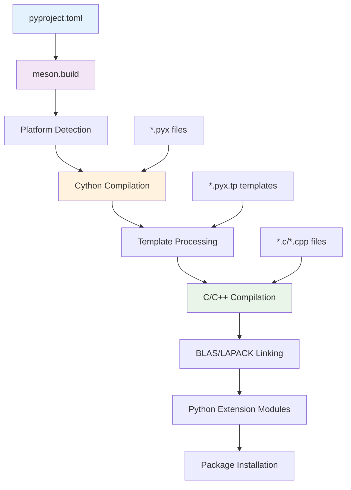
```mermaid
graph TD
    A[pyproject.toml] --> B[meson.build]
    B --> C[Platform Detection]
    C --> D[Cython Compilation]
    D --> E[Template Processing]
    E --> F[C/C++ Compilation]
    F --> G[BLAS/LAPACK Linking]
    G --> H[Python Extension Modules]
    H --> I[Package Installation]
    
    J[*.pyx.tp templates] --> E
    K[*.pyx files] --> D
    L[*.c/*.cpp files] --> F
    
    style A fill:#e3f2fd
    style B fill:#f3e5f5
    style D fill:#fff3e0
    style F fill:#e8f5e8
```

### Build Components Interaction

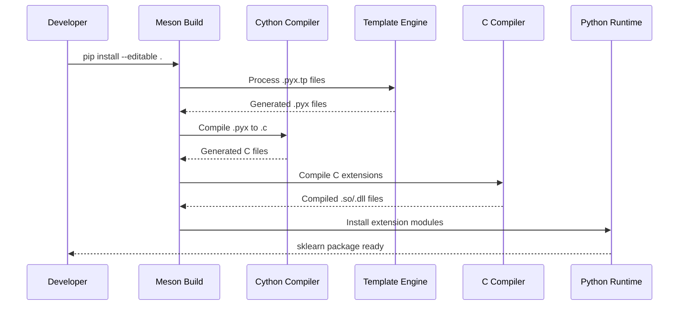
```mermaid
sequenceDiagram
    participant Dev as Developer
    participant Meson as Meson Build
    participant Cython as Cython Compiler
    participant Templates as Template Engine
    participant GCC as C Compiler
    participant Python as Python Runtime
    
    Dev->>Meson: pip install --editable .
    Meson->>Templates: Process .pyx.tp files
    Templates-->>Meson: Generated .pyx files
    Meson->>Cython: Compile .pyx to .c
    Cython-->>Meson: Generated C files
    Meson->>GCC: Compile C extensions
    GCC-->>Meson: Compiled .so/.dll files
    Meson->>Python: Install extension modules
    Python-->>Dev: sklearn package ready
```

### Dependency Graph

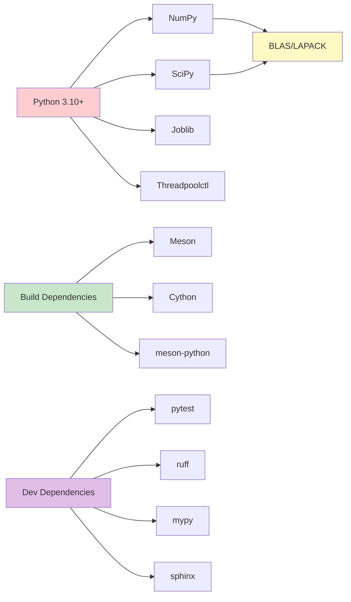
```mermaid
graph LR
    A[Python 3.10+] --> B[NumPy]
    A --> C[SciPy] 
    A --> D[Joblib]
    A --> E[Threadpoolctl]
    
    F[Build Dependencies] --> G[Meson]
    F --> H[Cython]
    F --> I[meson-python]
    
    B --> J[BLAS/LAPACK]
    C --> J
    
    K[Dev Dependencies] --> L[pytest]
    K --> M[ruff]
    K --> N[mypy]
    K --> O[sphinx]
    
    style A fill:#ffcdd2
    style F fill:#c8e6c9
    style J fill:#fff9c4
    style K fill:#e1bee7
```

### Template System (.pyx.tp files)

The `.pyx.tp` files are Cython templates that generate optimized code for different data types:

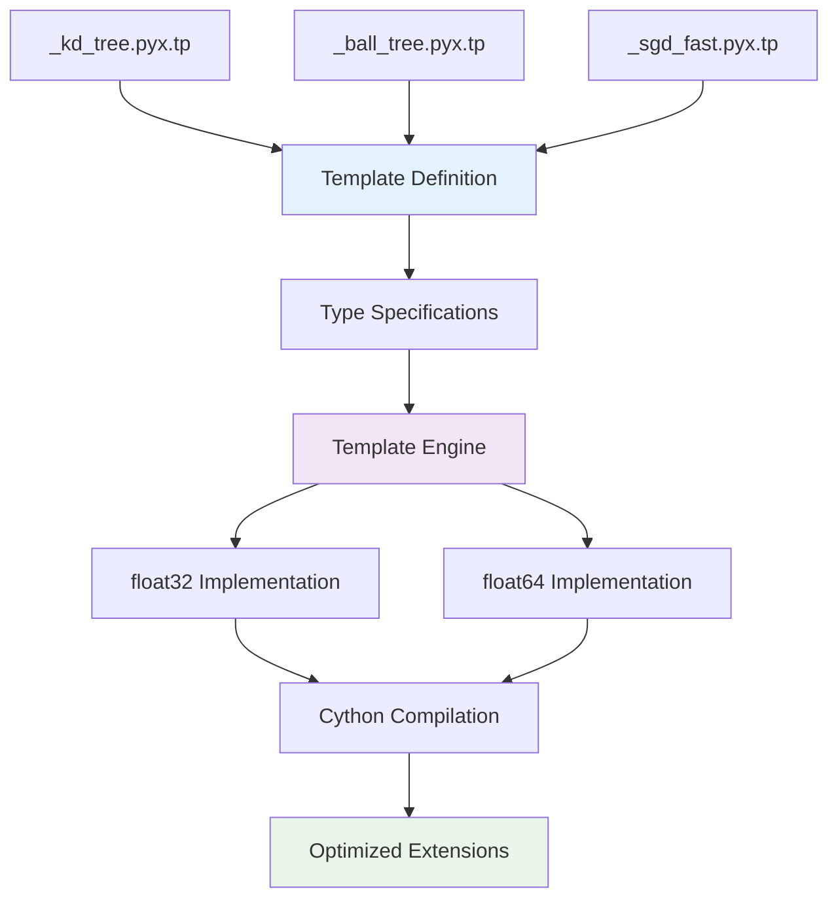
```mermaid
graph TD
    A[Template Definition] --> B[Type Specifications]
    B --> C[Template Engine]
    C --> D[float32 Implementation]
    C --> E[float64 Implementation]
    D --> F[Cython Compilation]
    E --> F
    F --> G[Optimized Extensions]
    
    H[_kd_tree.pyx.tp] --> A
    I[_ball_tree.pyx.tp] --> A
    J[_sgd_fast.pyx.tp] --> A
    
    style A fill:#e3f2fd
    style C fill:#f3e5f5
    style G fill:#e8f5e8
```

## Project Structure

```
scikit-learn/
├── sklearn/                    # Main package
│   ├── base.py                # Base classes for all estimators
│   ├── calibration.py         # Probability calibration
│   ├── cluster/               # Clustering algorithms
│   ├── decomposition/         # Matrix decomposition
│   ├── ensemble/              # Ensemble methods
│   ├── feature_extraction/    # Feature extraction
│   ├── feature_selection/     # Feature selection
│   ├── linear_model/          # Linear models
│   ├── metrics/               # Performance metrics
│   ├── model_selection/       # Model selection and validation
│   ├── neighbors/             # Nearest neighbors
│   ├── preprocessing/         # Data preprocessing
│   ├── svm/                   # Support Vector Machines
│   ├── tree/                  # Decision trees
│   └── utils/                 # Utility functions
├── examples/                  # Gallery examples
├── doc/                       # Documentation
├── benchmarks/                # Performance benchmarks
├── build_tools/               # Build and CI tools
└── tests/                     # Additional tests
```

### Module Organization
Each module typically contains:
- `__init__.py`: Public API exports
- `_base.py` or `_classes.py`: Core algorithm implementations
- `_*.py`: Private implementation files
- `tests/`: Unit tests
- `*.pyx`: Cython extensions for performance

## Development Workflow

### Feature Development Lifecycle

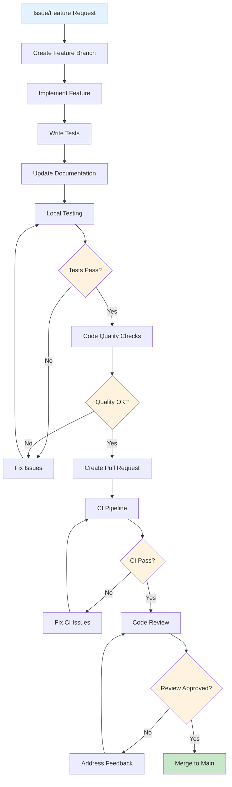
```mermaid
graph TD
    A[Issue/Feature Request] --> B[Create Feature Branch]
    B --> C[Implement Feature]
    C --> D[Write Tests]
    D --> E[Update Documentation]
    E --> F[Local Testing]
    F --> G{Tests Pass?}
    G -->|No| H[Fix Issues]
    H --> F
    G -->|Yes| I[Code Quality Checks]
    I --> J{Quality OK?}
    J -->|No| H
    J -->|Yes| K[Create Pull Request]
    K --> L[CI Pipeline]
    L --> M{CI Pass?}
    M -->|No| N[Fix CI Issues]
    N --> L
    M -->|Yes| O[Code Review]
    O --> P{Review Approved?}
    P -->|No| Q[Address Feedback]
    Q --> O
    P -->|Yes| R[Merge to Main]
    
    style A fill:#e3f2fd
    style R fill:#c8e6c9
    style G fill:#fff3e0
    style J fill:#fff3e0
    style M fill:#fff3e0
    style P fill:#fff3e0
```

### Development Process Flow

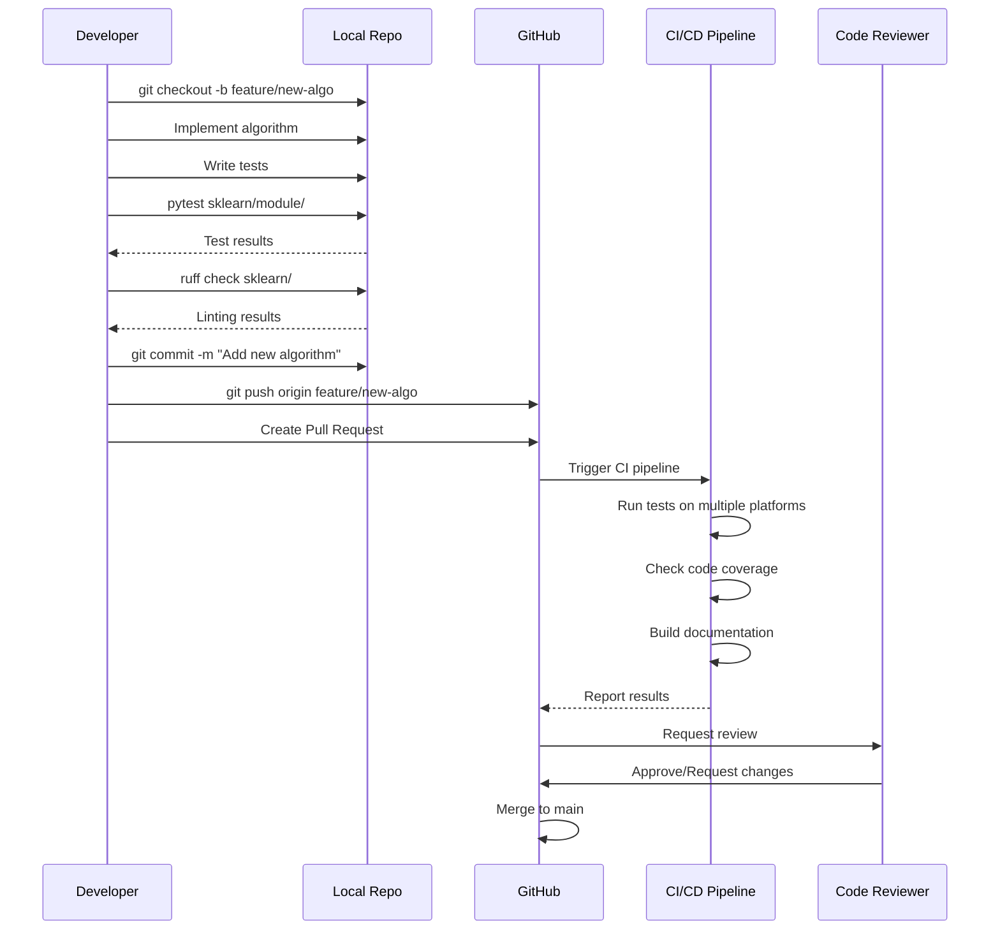
```mermaid
sequenceDiagram
    participant Dev as Developer
    participant Local as Local Repo
    participant GitHub as GitHub
    participant CI as CI/CD Pipeline
    participant Review as Code Reviewer
    
    Dev->>Local: git checkout -b feature/new-algo
    Dev->>Local: Implement algorithm
    Dev->>Local: Write tests
    Dev->>Local: pytest sklearn/module/
    Local-->>Dev: Test results
    Dev->>Local: ruff check sklearn/
    Local-->>Dev: Linting results
    Dev->>Local: git commit -m "Add new algorithm"
    Dev->>GitHub: git push origin feature/new-algo
    Dev->>GitHub: Create Pull Request
    GitHub->>CI: Trigger CI pipeline
    CI->>CI: Run tests on multiple platforms
    CI->>CI: Check code coverage
    CI->>CI: Build documentation
    CI-->>GitHub: Report results
    GitHub->>Review: Request review
    Review->>GitHub: Approve/Request changes
    GitHub->>GitHub: Merge to main
```

### CI/CD Pipeline Architecture

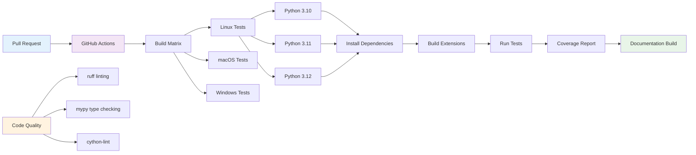
```mermaid
graph LR
    A[Pull Request] --> B[GitHub Actions]
    B --> C[Build Matrix]
    C --> D[Linux Tests]
    C --> E[macOS Tests]  
    C --> F[Windows Tests]
    
    D --> G[Python 3.10]
    D --> H[Python 3.11]
    D --> I[Python 3.12]
    
    G --> J[Install Dependencies]
    H --> J
    I --> J
    
    J --> K[Build Extensions]
    K --> L[Run Tests]
    L --> M[Coverage Report]
    M --> N[Documentation Build]
    
    O[Code Quality] --> P[ruff linting]
    O --> Q[mypy type checking]
    O --> R[cython-lint]
    
    style A fill:#e3f2fd
    style B fill:#f3e5f5
    style N fill:#e8f5e8
    style O fill:#fff3e0
```

### Testing Strategy

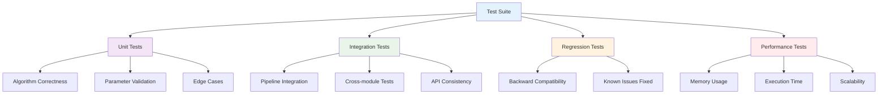
```mermaid
graph TD
    A[Test Suite] --> B[Unit Tests]
    A --> C[Integration Tests]
    A --> D[Regression Tests]
    A --> E[Performance Tests]
    
    B --> F[Algorithm Correctness]
    B --> G[Parameter Validation]
    B --> H[Edge Cases]
    
    C --> I[Pipeline Integration]
    C --> J[Cross-module Tests]
    C --> K[API Consistency]
    
    D --> L[Backward Compatibility]
    D --> M[Known Issues Fixed]
    
    E --> N[Memory Usage]
    E --> O[Execution Time]
    E --> P[Scalability]
    
    style A fill:#e3f2fd
    style B fill:#f3e5f5
    style C fill:#e8f5e8
    style D fill:#fff3e0
    style E fill:#ffebee
```

### Creating a New Feature

1. **Create a Feature Branch**
   ```bash
   git checkout main
   git fetch upstream
   git merge upstream/main
   git checkout -b feature/my-new-feature
   ```

2. **Development Cycle**
   - Implement your feature
   - Write tests
   - Update documentation
   - Run tests locally
   - Commit changes

3. **Running Tests**
   ```bash
   # Test specific module
   pytest sklearn/linear_model/tests/test_logistic.py
   
   # Test with coverage
   pytest --cov sklearn/linear_model sklearn/linear_model/tests/
   
   # Run all tests (takes a long time)
   pytest sklearn/
   ```

4. **Code Quality Checks**
   ```bash
   # Linting
   ruff check sklearn/
   
   # Type checking
   mypy sklearn/
   
   # Format check
   ruff format --check sklearn/
   ```

5. **Build Documentation**
   ```bash
   cd doc
   make html  # Full build with examples (slow)
   make      # Quick build without examples
   ```

### Pull Request Process

1. **Push Your Branch**
   ```bash
   git push -u origin feature/my-new-feature
   ```

2. **Create Pull Request**
   - Go to GitHub and create a PR
   - Fill out the PR template
   - Link to related issues

3. **PR Requirements**
   - [ ] Tests pass on CI
   - [ ] Code coverage ≥ 90%
   - [ ] Documentation updated
   - [ ] Code follows style guidelines
   - [ ] No merge conflicts with main

## Code Style and Standards

### Python Style
- Follow PEP 8 with line length limit of 88 characters
- Use `ruff` for linting and formatting
- Type hints encouraged for new code

### Docstring Format
Follow NumPy docstring conventions:

```python
def example_function(param1, param2="default"):
    """Short description of the function.
    
    Longer description explaining the purpose and behavior.
    
    Parameters
    ----------
    param1 : array-like of shape (n_samples, n_features)
        Description of param1.
    param2 : str, default="default"
        Description of param2.
        
    Returns
    -------
    output : ndarray of shape (n_samples,)
        Description of return value.
        
    Examples
    --------
    >>> from sklearn.module import example_function
    >>> result = example_function([[1, 2], [3, 4]])
    >>> print(result)
    [1 2]
    """
```

### Estimator Guidelines
All estimators must:
- Inherit from appropriate base classes (`BaseEstimator`, `ClassifierMixin`, etc.)
- Implement `fit()` method
- Store hyperparameters as attributes with same names as constructor parameters
- Use `sklearn.utils.validation.check_*` functions for input validation
- Follow the scikit-learn API conventions

### Estimator Lifecycle and Data Flow

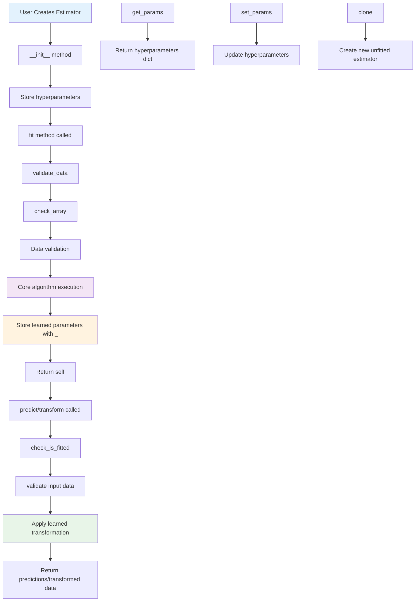
```mermaid
graph TD
    A[User Creates Estimator] --> B[__init__ method]
    B --> C[Store hyperparameters]
    C --> D[fit method called]
    
    D --> E[validate_data]
    E --> F[check_array]
    F --> G[Data validation]
    G --> H[Core algorithm execution]
    H --> I[Store learned parameters with _]
    I --> J[Return self]
    
    J --> K[predict/transform called]
    K --> L[check_is_fitted]
    L --> M[validate input data]
    M --> N[Apply learned transformation]
    N --> O[Return predictions/transformed data]
    
    P[get_params] --> Q[Return hyperparameters dict]
    R[set_params] --> S[Update hyperparameters]
    T[clone] --> U[Create new unfitted estimator]
    
    style A fill:#e3f2fd
    style H fill:#f3e5f5
    style N fill:#e8f5e8
    style I fill:#fff3e0
```

### Data Validation Flow

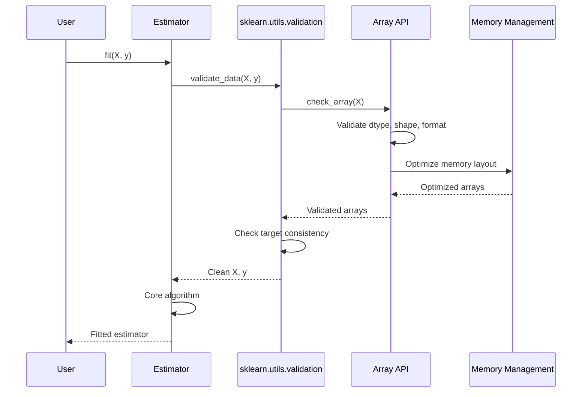
```mermaid
sequenceDiagram
    participant User
    participant Estimator
    participant Validation as sklearn.utils.validation
    participant ArrayAPI as Array API
    participant Memory as Memory Management
    
    User->>Estimator: fit(X, y)
    Estimator->>Validation: validate_data(X, y)
    Validation->>ArrayAPI: check_array(X)
    ArrayAPI->>ArrayAPI: Validate dtype, shape, format
    ArrayAPI->>Memory: Optimize memory layout
    Memory-->>ArrayAPI: Optimized arrays
    ArrayAPI-->>Validation: Validated arrays
    Validation->>Validation: Check target consistency
    Validation-->>Estimator: Clean X, y
    Estimator->>Estimator: Core algorithm
    Estimator-->>User: Fitted estimator
```

### Pipeline Data Flow

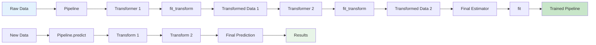
```mermaid
graph LR
    A[Raw Data] --> B[Pipeline]
    B --> C[Transformer 1]
    C --> D[fit_transform]
    D --> E[Transformed Data 1]
    
    E --> F[Transformer 2]
    F --> G[fit_transform]
    G --> H[Transformed Data 2]
    
    H --> I[Final Estimator]
    I --> J[fit]
    J --> K[Trained Pipeline]
    
    L[New Data] --> M[Pipeline.predict]
    M --> N[Transform 1]
    N --> O[Transform 2] 
    O --> P[Final Prediction]
    P --> Q[Results]
    
    style A fill:#e3f2fd
    style K fill:#c8e6c9
    style Q fill:#e8f5e8
```

### Memory Management and Performance

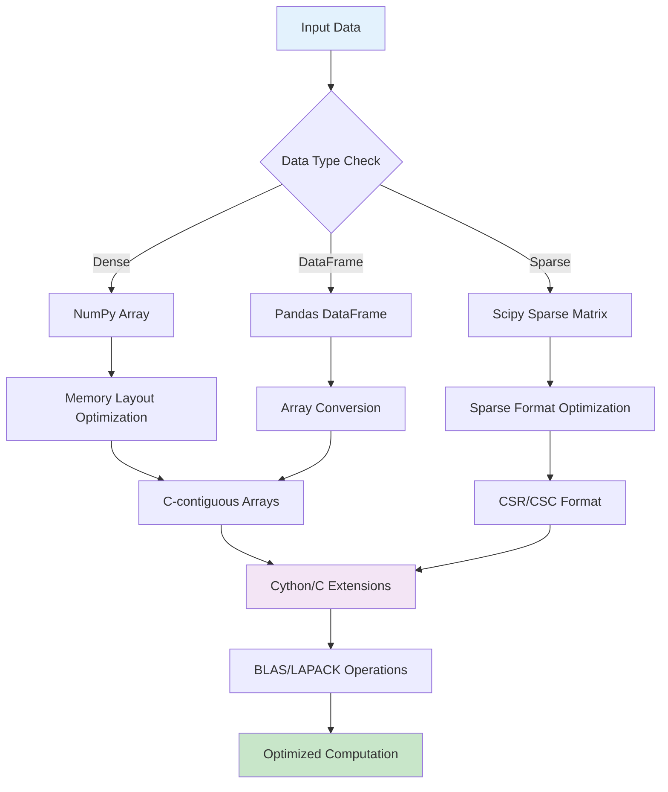
```mermaid
graph TD
    A[Input Data] --> B{Data Type Check}
    B -->|Dense| C[NumPy Array]
    B -->|Sparse| D[Scipy Sparse Matrix]
    B -->|DataFrame| E[Pandas DataFrame]
    
    C --> F[Memory Layout Optimization]
    D --> G[Sparse Format Optimization]
    E --> H[Array Conversion]
    
    F --> I[C-contiguous Arrays]
    G --> J[CSR/CSC Format]
    H --> I
    
    I --> K[Cython/C Extensions]
    J --> K
    K --> L[BLAS/LAPACK Operations]
    L --> M[Optimized Computation]
    
    style A fill:#e3f2fd
    style M fill:#c8e6c9
    style K fill:#f3e5f5
```

## Testing

### Test Structure
```python
import numpy as np
import pytest
from sklearn.model import MyEstimator
from sklearn.utils._testing import assert_array_equal

class TestMyEstimator:
    def test_basic_functionality(self):
        """Test basic estimator functionality."""
        X = np.array([[1, 2], [3, 4]])
        y = np.array([0, 1])
        
        estimator = MyEstimator()
        estimator.fit(X, y)
        
        assert hasattr(estimator, 'classes_')
        assert_array_equal(estimator.classes_, [0, 1])
        
    def test_input_validation(self):
        """Test input validation."""
        estimator = MyEstimator()
        
        # Test invalid input
        with pytest.raises(ValueError):
            estimator.fit([[1, 2]], [])
```

### Test Coverage
- Aim for 90%+ test coverage
- Test edge cases and error conditions
- Test with different input types (dense, sparse arrays)
- Test parameter validation

## Documentation

### Types of Documentation

1. **API Documentation**: Docstrings in code
2. **User Guide**: Conceptual explanations in `doc/modules/`
3. **Examples**: Runnable examples in `examples/`
4. **Tutorials**: Step-by-step guides

### Building Documentation
```bash
cd doc

# Quick build (no examples)
make

# Full build with examples
make html

# Build specific example
EXAMPLES_PATTERN="plot_calibration" make html
```

## Sample Feature Implementation

### Example: Adding a New Preprocessing Transformer

Let's implement a simple feature normalizer as an example:

#### 1. Create the Main Implementation

```python
# sklearn/preprocessing/_feature_normalizer.py
"""
Feature normalizer implementation.
"""

# Authors: The scikit-learn developers
# SPDX-License-Identifier: BSD-3-Clause

import numpy as np
from sklearn.base import BaseEstimator, TransformerMixin
from sklearn.utils.validation import check_array, check_is_fitted

class FeatureNormalizer(BaseEstimator, TransformerMixin):
    """Normalize features by dividing by their maximum absolute value.
    
    This transformer scales each feature by dividing by the maximum absolute
    value of that feature across all samples.
    
    Parameters
    ----------
    copy : bool, default=True
        Whether to make a copy of the input data or modify it in place.
        
    Attributes
    ----------
    max_abs_ : ndarray of shape (n_features,)
        Per feature maximum absolute value.
        
    Examples
    --------
    >>> from sklearn.preprocessing import FeatureNormalizer
    >>> X = [[1, 2], [3, 4], [-1, -2]]
    >>> normalizer = FeatureNormalizer()
    >>> normalizer.fit(X)
    FeatureNormalizer()
    >>> normalizer.transform(X)
    array([[ 0.33333333,  0.5       ],
           [ 1.        ,  1.        ],
           [-0.33333333, -0.5       ]])
    """
    
    def __init__(self, copy=True):
        self.copy = copy
    
    def fit(self, X, y=None):
        """Compute the maximum absolute value for each feature.
        
        Parameters
        ----------
        X : array-like of shape (n_samples, n_features)
            The training input samples.
        y : Ignored
            Not used, present here for API consistency by convention.
            
        Returns
        -------
        self : object
            Returns the instance itself.
        """
        X = check_array(X, accept_sparse=False)
        self.max_abs_ = np.max(np.abs(X), axis=0)
        # Avoid division by zero
        self.max_abs_ = np.where(self.max_abs_ == 0, 1, self.max_abs_)
        return self
    
    def transform(self, X):
        """Normalize features by their maximum absolute value.
        
        Parameters
        ----------
        X : array-like of shape (n_samples, n_features)
            The input samples.
            
        Returns
        -------
        X_transformed : ndarray of shape (n_samples, n_features)
            The normalized input samples.
        """
        check_is_fitted(self)
        X = check_array(X, accept_sparse=False, copy=self.copy)
        return X / self.max_abs_
```

#### 2. Add Tests

```python
# sklearn/preprocessing/tests/test_feature_normalizer.py
"""
Tests for FeatureNormalizer.
"""

import numpy as np
import pytest
from sklearn.preprocessing._feature_normalizer import FeatureNormalizer
from sklearn.utils._testing import assert_array_almost_equal

class TestFeatureNormalizer:
    def test_basic_functionality(self):
        """Test basic normalization functionality."""
        X = np.array([[1, 2], [3, 4], [-1, -2]])
        normalizer = FeatureNormalizer()
        
        X_transformed = normalizer.fit_transform(X)
        
        # Check that max absolute values are 1
        assert np.allclose(np.max(np.abs(X_transformed), axis=0), 1)
        
        # Check specific values
        expected = np.array([[1/3, 0.5], [1, 1], [-1/3, -0.5]])
        assert_array_almost_equal(X_transformed, expected)
    
    def test_zero_feature(self):
        """Test handling of zero features."""
        X = np.array([[0, 1], [0, 2], [0, 3]])
        normalizer = FeatureNormalizer()
        
        X_transformed = normalizer.fit_transform(X)
        
        # Zero features should remain zero
        assert np.allclose(X_transformed[:, 0], 0)
        # Other features should be normalized
        assert np.allclose(np.max(np.abs(X_transformed[:, 1])), 1)
    
    def test_copy_parameter(self):
        """Test copy parameter."""
        X = np.array([[1, 2], [3, 4]], dtype=float)
        X_original = X.copy()
        
        # Test copy=True (default)
        normalizer = FeatureNormalizer(copy=True)
        X_transformed = normalizer.fit_transform(X)
        assert_array_almost_equal(X, X_original)  # Original unchanged
        
        # Test copy=False
        normalizer = FeatureNormalizer(copy=False)
        normalizer.fit(X)
        X_transformed = normalizer.transform(X)
        # Original should be modified
        assert not np.allclose(X, X_original)
    
    def test_not_fitted_error(self):
        """Test error when transform is called before fit."""
        normalizer = FeatureNormalizer()
        X = np.array([[1, 2], [3, 4]])
        
        with pytest.raises(ValueError, match="This FeatureNormalizer instance is not fitted yet"):
            normalizer.transform(X)
```

#### 3. Update Module Imports

```python
# sklearn/preprocessing/__init__.py
# Add to existing imports:
from ._feature_normalizer import FeatureNormalizer

# Add to __all__ list:
__all__ = [
    # ... existing exports ...
    'FeatureNormalizer',
]
```

#### 4. Add Documentation

```python
# doc/modules/preprocessing.rst
# Add section about FeatureNormalizer with examples
```

#### 5. Add Example

```python
# examples/preprocessing/plot_feature_normalizer.py
"""
==================================
Feature Normalization Demonstration
==================================

This example demonstrates the FeatureNormalizer transformer.
"""

import numpy as np
import matplotlib.pyplot as plt
from sklearn.preprocessing import FeatureNormalizer

# Generate sample data
np.random.seed(42)
X = np.random.randn(100, 2)
X[:, 0] *= 10  # Scale first feature
X[:, 1] *= 2   # Scale second feature

# Apply normalization
normalizer = FeatureNormalizer()
X_normalized = normalizer.fit_transform(X)

# Plot results
fig, (ax1, ax2) = plt.subplots(1, 2, figsize=(12, 5))

ax1.scatter(X[:, 0], X[:, 1], alpha=0.6)
ax1.set_title('Original Data')
ax1.set_xlabel('Feature 1')
ax1.set_ylabel('Feature 2')

ax2.scatter(X_normalized[:, 0], X_normalized[:, 1], alpha=0.6)
ax2.set_title('Normalized Data')
ax2.set_xlabel('Feature 1 (normalized)')
ax2.set_ylabel('Feature 2 (normalized)')

plt.tight_layout()
plt.show()
```

## Common Development Tasks

### Adding a New Estimator

1. **Choose the appropriate module** (e.g., `linear_model`, `ensemble`)
2. **Inherit from base classes**: `BaseEstimator` + mixin (`ClassifierMixin`, `RegressorMixin`, etc.)
3. **Implement required methods**: `fit()`, and prediction methods
4. **Add parameter validation** using `sklearn.utils._param_validation`
5. **Write comprehensive tests**
6. **Add documentation and examples**

### Performance Optimization

#### Optimization Strategy Flow

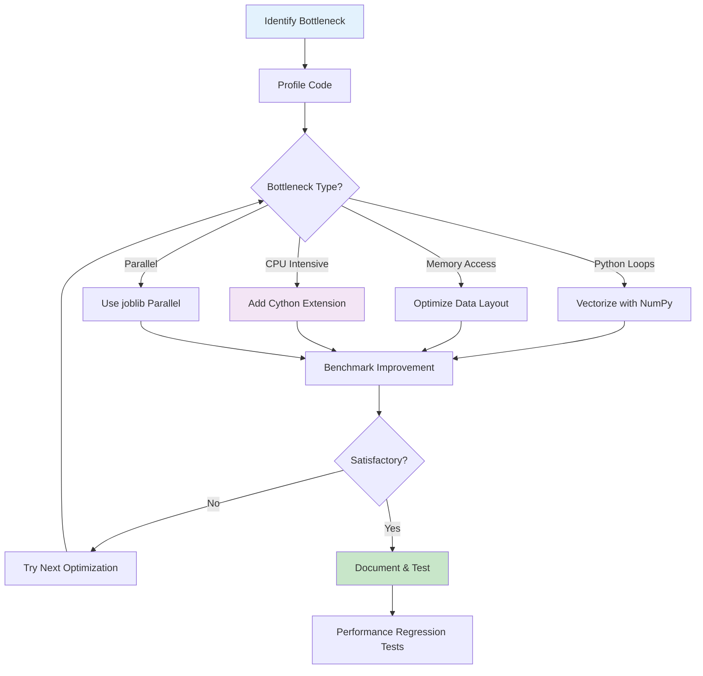
```mermaid
graph TD
    A[Identify Bottleneck] --> B[Profile Code]
    B --> C{Bottleneck Type?}
    
    C -->|Python Loops| D[Vectorize with NumPy]
    C -->|Memory Access| E[Optimize Data Layout]
    C -->|CPU Intensive| F[Add Cython Extension]
    C -->|Parallel| G[Use joblib Parallel]
    
    D --> H[Benchmark Improvement]
    E --> H
    F --> H
    G --> H
    
    H --> I{Satisfactory?}
    I -->|No| J[Try Next Optimization]
    I -->|Yes| K[Document & Test]
    
    J --> C
    K --> L[Performance Regression Tests]
    
    style A fill:#e3f2fd
    style K fill:#c8e6c9
    style F fill:#f3e5f5
```

#### Cython Integration Workflow

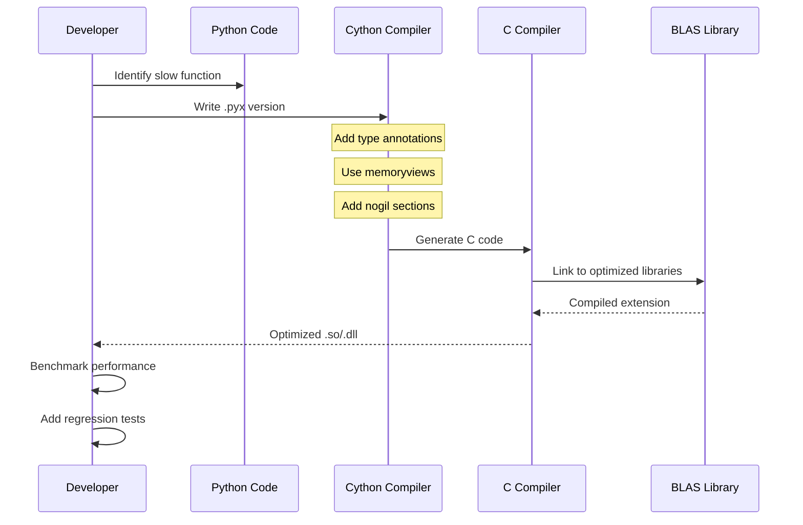
```mermaid
sequenceDiagram
    participant Dev as Developer
    participant Python as Python Code
    participant Cython as Cython Compiler
    participant C as C Compiler
    participant BLAS as BLAS Library
    
    Dev->>Python: Identify slow function
    Dev->>Cython: Write .pyx version
    Note over Cython: Add type annotations
    Note over Cython: Use memoryviews
    Note over Cython: Add nogil sections
    
    Cython->>C: Generate C code
    C->>BLAS: Link to optimized libraries
    BLAS-->>C: Compiled extension
    C-->>Dev: Optimized .so/.dll
    
    Dev->>Dev: Benchmark performance
    Dev->>Dev: Add regression tests
```

#### Memory Hierarchy Optimization

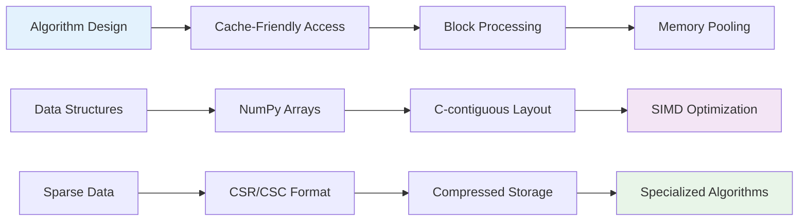
```mermaid
graph LR
    A[Algorithm Design] --> B[Cache-Friendly Access]
    B --> C[Block Processing]
    C --> D[Memory Pooling]
    
    E[Data Structures] --> F[NumPy Arrays]
    F --> G[C-contiguous Layout]
    G --> H[SIMD Optimization]
    
    I[Sparse Data] --> J[CSR/CSC Format]
    J --> K[Compressed Storage]
    K --> L[Specialized Algorithms]
    
    style A fill:#e3f2fd
    style H fill:#f3e5f5
    style L fill:#e8f5e8
```

1. **Profile your code** using `cProfile` or `line_profiler`
2. **Use Cython** for computational bottlenecks
3. **Leverage NumPy operations** instead of Python loops
4. **Consider sparse matrix support** when appropriate
5. **Use `sklearn.utils.parallel.Parallel`** for parallelization

#### Parallel Computing Architecture

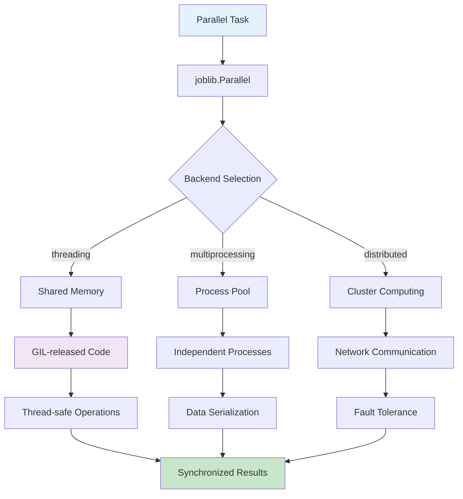
```mermaid
graph TD
    A[Parallel Task] --> B[joblib.Parallel]
    B --> C{Backend Selection}
    
    C -->|threading| D[Shared Memory]
    C -->|multiprocessing| E[Process Pool]
    C -->|distributed| F[Cluster Computing]
    
    D --> G[GIL-released Code]
    E --> H[Independent Processes]
    F --> I[Network Communication]
    
    G --> J[Thread-safe Operations]
    H --> K[Data Serialization]
    I --> L[Fault Tolerance]
    
    J --> M[Synchronized Results]
    K --> M
    L --> M
    
    style A fill:#e3f2fd
    style M fill:#c8e6c9
    style G fill:#f3e5f5
```

### Debugging Tips

1. **Use pytest's debugging features**:
   ```bash
   pytest -xvs sklearn/module/tests/test_file.py::test_function
   ```

2. **Enable warnings**:
   ```python
   import warnings
   warnings.simplefilter('always')
   ```

3. **Use development builds** with debug symbols:
   ```bash
   pip install --no-build-isolation --editable . -Csetup-args=-Dbuildtype=debug
   ```

## Troubleshooting

### Common Issues

1. **Build Failures**
   - Ensure all build dependencies are installed
   - Try cleaning build artifacts: `git clean -fdx`
   - Check Cython and NumPy versions

2. **Import Errors**
   - Verify scikit-learn was built correctly
   - Check PYTHONPATH and virtual environment

3. **Test Failures**
   - Update to latest main branch
   - Check for environmental differences
   - Run tests in isolation

4. **Documentation Build Issues**
   - Install all documentation dependencies
   - Check Sphinx version compatibility
   - Clear documentation build cache

### Getting Help

1. **Documentation**: https://scikit-learn.org/dev/developers/
2. **GitHub Discussions**: https://github.com/scikit-learn/scikit-learn/discussions
3. **Discord**: https://discord.gg/h9qyrK8Jc8
4. **Mailing List**: scikit-learn@python.org

### Development Resources

- **API Design**: Follow existing patterns in the codebase
- **Performance**: Use `asv` benchmarks to track performance
- **Code Review**: All PRs require approval from two core developers
- **Continuous Integration**: Tests run on multiple platforms and Python versions

---

This guide covers the essential aspects of scikit-learn development. For the most up-to-date information, always refer to the official documentation and contributing guidelines.